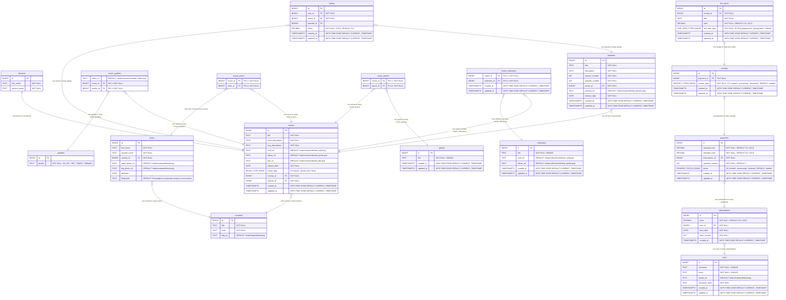

```mermaid
erDiagram
    genres {
      BIGINT id PK
      TEXT title "NOT NULL, UNIQUE"
      TIMESTAMPTZ created_at "WITH TIME ZONE DEFAULT CURRENT_TIMESTAMP"
      TIMESTAMPTZ updated_at "WITH TIME ZONE DEFAULT CURRENT_TIMESTAMP"
    }

    directors {
      BIGINT id PK
      TEXT first_name "NOT NULL"
      TEXT second_name "NOT NULL"
    }

    users {
      BIGINT id PK
      TEXT username "NOT NULL, UNIQUE"
      TEXT email "NOT NULL, UNIQUE"
      TEXT avatar_url "DEFAULT '/static/avatars/default.png'"
      TEXT password_hash "NOT NULL"
      TIMESTAMPTZ created_at "WITH TIME ZONE DEFAULT CURRENT_TIMESTAMP"
      TIMESTAMPTZ updated_at "WITH TIME ZONE DEFAULT CURRENT_TIMESTAMP"
    }

    countries {
      BIGINT id PK
      TEXT title "NOT NULL"
      TEXT code "NOT NULL"
      TEXT flag_url "DEFAULT '/static/flags/default.png'"
    }

    movies {
      BIGINT id PK
      TEXT title "NOT NULL"
      TEXT short_description "NOT NULL"
      TEXT long_description "NOT NULL"
      TEXT card_url "DEFAULT '/static/movies/default_card.png'"
      TEXT album_url "DEFAULT '/static/movies/default_poster.png'"
      TEXT title_url "DEFAULT '/static/movies/default_title.png'"
      DATE release_date "NOT NULL"
      MOVIE_TYPE_ENUM movie_type "IN ('movie', 'serial'), NOT NULL"
      BIGINT country_id FK "NOT NULL"
      BIGINT director_id FK "NOT NULL"
      TIMESTAMPTZ created_at "WITH TIME ZONE DEFAULT CURRENT_TIMESTAMP"
      TIMESTAMPTZ updated_at "WITH TIME ZONE DEFAULT CURRENT_TIMESTAMP"
    }

    episodes {
      BIGINT id PK
      TEXT title "NOT NULL"
      TEXT description "NOT NULL"
      INT season_number "NOT NULL"
      INT episode_number "NOT NULL"
      BIGINT movie_id FK "NOT NULL"
      TEXT preview_url "DEFAULT '/static/movies/default_preview.png'"
      DATE release_date "NOT NULL"
      TIMESTAMPTZ created_at "WITH TIME ZONE DEFAULT CURRENT_TIMESTAMP"
      TIMESTAMPTZ updated_at "WITH TIME ZONE DEFAULT CURRENT_TIMESTAMP"
    }

    ratings {
      BIGINT id PK
      BIGINT user_id FK "NOT NULL"
      BIGINT movie_id FK "NOT NULL"
      BIGING episode_id FK
      DECIMAL rating "NOT NULL, (10,2), DEFAULT '0.0'"
      TIMESTAMPTZ created_at "WITH TIME ZONE DEFAULT CURRENT_TIMESTAMP"
      TIMESTAMPTZ updated_at "WITH TIME ZONE DEFAULT CURRENT_TIMESTAMP"
    }

    movie_qualities {
      TEXT video_url "DEFAULT '/static/movies/cassette_video.mp4'"
      BIGINT movie_id FK "PK1.1 NOT NULL"
      BIGINT quality_id FK "PK1.2 NOT NULL"
    }

    qualities {
      BIGINT id PK
      TEXT quality "NOT NULL, IN ('144', '360', '720p50', '1080p50')"
    }

    actors {
      BIGINT id PK
      TEXT first_name "NOT NULL"
      TEXT second_name "NOT NULL"
      BIGINT country_id FK "NOT NULL"
      TEXT small_photo_url "DEFAULT '/static/avatars/default.png'"
      TEXT big_photo_url "DEFAULT '/static/avatars/default.png'"
      DATE birthdate
      TEXT biography "DEFAULT 'Биография по данному актеру не заполнена'"
    }

    movie_actors {
      BIGINT movie_id FK "PK1.1, NOT NULL"
      BIGINT actor_id FK "PK1.2, NOT NULL"
    }

    movie_genres {
      BIGINT movie_id FK "PK1.1, NOT NULL"
      BIGINT genre_id FK "PK1.2, NOT NULL"
    }

    collections {
      BIGINT id PK
      TEXT title "NOT NULL, UNIQUE"
      TEXT card_url "DEFAULT '/static/collections/default_card.png'"
      TEXT album_url "DEFAULT '/static/collections/default_poster.png'"
      TIMESTAMPTZ created_at "WITH TIME ZONE DEFAULT CURRENT_TIMESTAMP"
      TIMESTAMPTZ updated_at "WITH TIME ZONE DEFAULT CURRENT_TIMESTAMP"
    }

    movie_collections {
      BIGINT movie_id FK "PK1.1, NOT NULL"
      BIGINT collection_id FK "PK1.2, NOT NULL"
      TIMESTAMPTZ created_at "WITH TIME ZONE DEFAULT CURRENT_TIMESTAMP"
      TIMESTAMPTZ updated_at "WITH TIME ZONE DEFAULT CURRENT_TIMESTAMP"
    }

    subscriptions {
      BIGINT id PK
      DECIMAL price "NOT NULL, DEFAULT 0.0, (10,2)"
      BIGINT user_id FK "NOT NULL"
      DATE start_date "NOT NULL"
      INT days_counter "NOT NULL"
      TIMESTAMPTZ created_at "WITH TIME ZONE DEFAULT CURRENT_TIMESTAMP"
    }

    payments {
      BIGINT id PK
      DECIMAL captured_total "NOT NULL, DEFAULT 0.0, (10,2)"
      DECIMAL refunded_total "NOT NULL, DEFAULT 0.0, (10,2)"
      BIGINT subscription_id FK "NOT NULL"
      INT payment_number "NOT NULL, DEFAULT 1"
      PAYMENT_STATUS_ENUM status "IN ('started', 'processing', 'finished'), DEFAULT 'started'"
      TIMESTAMPTZ created_at "WITH TIME ZONE DEFAULT CURRENT_TIMESTAMP"
      TIMESTAMPTZ updated_at "WITH TIME ZONE DEFAULT CURRENT_TIMESTAMP"
    }

    receipts {
      BIGINT id PK
      BIGINT payment_id FK "NOT NULL"
      RECEIPT_TYPES_ENUM receipt_type "NOT NULL, IN ('created', 'processing', 'fiscalized'), DEFAULT 'created'"
      TIMESTAMPTZ created_at "WITH TIME ZONE DEFAULT CURRENT_TIMESTAMP"
      TIMESTAMPTZ updated_at "WITH TIME ZONE DEFAULT CURRENT_TIMESTAMP"
    }

    line_items {
      BIGINT id PK
      BIGINT receipt_id FK "NOT NULL"
      TEXT title "NOT NULL"
      DECIMAL total "NOT NULL, DEFAULT 0.0, (10,2)"
      LINE_ITEM_TYPES_ENUM line_item_type "NOT NULL, IN ('full_prepayment', 'prepayment', 'refund')"
      TIMESTAMPTZ created_at "WITH TIME ZONE DEFAULT CURRENT_TIMESTAMP"
      TIMESTAMPTZ updated_at "WITH TIME ZONE DEFAULT CURRENT_TIMESTAMP"
    }

    subscriptions o{--|| users : "one user to many subscriptions"
    movie_genres o{--|| genres : "one genre to many movie_genres"
    movie_genres o{--|| movies : "one movie to many movie_genres"
    movie_actors o{--|| movies : "one movie to many movie_actors"
    movie_actors o{--|| actors : "one actor to many movie_actors"
    movie_collections o{--|| movies : "one movie to many movie_collections"
    movie_collections o{--|| collections : "one collection to many movie_collections"
    movie_qualities o{--|| movies : "one movie to many movie_qualities"
    movie_qualities o{--|| qualities : "one quality to many movie_qualities"
    episodes o{--|| movies : "one movie to many serials"
    ratings o{--|| episodes : "one episode to many ratings"
    ratings o{--|| movies : "one movie to many ratings"
    movies o{--|| countries : "one country to many movies"
    actors o{--|| countries : "one country to many actors"
    directors ||--|| movies : "one movie to one director"
    payments |{--|| subscriptions : "one subscription to many payments"
    receipts |{--|| payments : "one payment to many receipts"
    line_items |{--|| receipts : "one receipt to many line_items"
```
